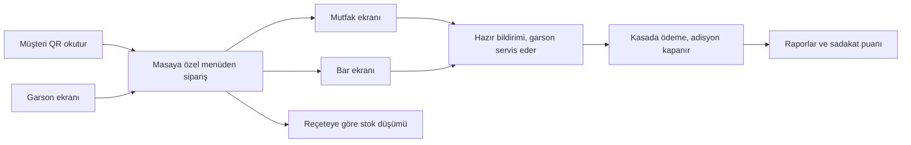

<p align="center">
  
</p>

<h1 align="center">Mizan</h1>

<p align="center"><b>Restoran Yönetim Sistemi</b></p>

<p align="center">
  QR menüden mutfağa, kasadan stoğa restoranın tüm işleyişini tek yerden yönetin.<br />
  Rol ve izin bazlı yetkilendirmeyle her personel <b>yalnızca kendi işini</b> görür.
</p>

<p align="center">
  
  
  
  
  
  
  
</p>

---

## Özellikler

**Müşteri tarafı**
- Masaya özel QR menü: ürün seçenekleriyle sipariş, sepet, garson çağırma, hesap isteme
- Yönetim panelinden düzenlenen restoran sitesi: ana sayfa bölümleri, menü, galeri, rezervasyon, SSS, iletişim, müşteri değerlendirmeleri
- SEO: sayfa bazlı meta etiketleri, `sitemap.xml`, `robots.txt`, JSON-LD yapısal veri

**Operasyon**
- Garson sipariş ekranı ve adisyon; indirim/ikram talebi ve yönetici onayı
- Mutfak ve bar ekranları: siparişler bölüme göre ayrılır, bekleme süresi renkle uyarır
- Kasa: ödeme alma, kısmi ödeme, vardiya açma/kapatma, fiş yazdırma
- SignalR ile anlık bildirimler

**Yönetim**
- Çoklu restoran / şube / alan / masa yapısı
- Stok: malzemeler, reçeteler, siparişte otomatik stok düşümü, satın alma, tedarikçiler, kritik stok uyarısı
- Müşteri kaydı ve sadakat seviyeleri, kampanyalar, rezervasyonlar
- Raporlar: satış, ürün ve kasa raporları, CSV dışa aktarma
- Görünüm ayarları: site ve panel renkleri, yazı tipleri
- Site adresi (QR kodlarının yönlendiği adres) panelden ayarlanır; bilgisayarın yerel ağ adresi otomatik önerilir

**Güvenlik ve altyapı**
- 10 hazır rol (Süper Admin, Restoran Sahibi, Müdür, Garson, Kasiyer, Mutfak, Bar, Depo, Muhasebe, Rapor Görüntüleyici) + panelden tanımlanan özel roller; izin bazlı yetkilendirme, modül aç/kapa
- İşlem kaydı (audit log), hatalı girişte hesap kilitleme, oturumu kilitleme
- IP bazlı hız sınırlama, güvenlik başlıkları (CSP, X-Frame-Options vb.)
- Otomatik veritabanı yedekleme, `/health` sağlık kontrolü, Windows Service desteği

## Nasıl Çalışır



Sipariş masadan (QR) ya da garson ekranından verilir; yemekler mutfağa, içecekler bara ayrı düşer. Ürün hazır olduğunda garsona anlık bildirim gider. Ödeme kasada alınır, adisyon kapanır; satışlar raporlara, harcama müşterinin sadakat puanına yansır.

## Hızlı Başlangıç

**Gereksinimler:** [.NET 10 SDK](https://dotnet.microsoft.com/download) ve SQL Server (ücretsiz Express sürümü yeterli). Veritabanı ve tablolar ilk açılışta otomatik oluşturulur.

```bash
git clone https://github.com/YunusEmr044/Mizan-Restoran-Yonetim-Sistemi.git
cd Mizan-Restoran-Yonetim-Sistemi
```

Proje kökünde `appsettings.Development.json` oluşturun (bu dosya `.gitignore`'dadır):

```json
{
  "ConnectionStrings": {
    "DefaultConnection": "Server=.\\SQLEXPRESS;Database=RestoranYonetimDb;Trusted_Connection=True;TrustServerCertificate=True;MultipleActiveResultSets=true"
  }
}
```

```bash
dotnet run
```

Site `http://localhost:5080`, yönetim paneli `http://localhost:5080/admin` adresinde açılır.

<details>
<summary><b>Örnek hesaplar</b> (yalnızca geliştirme ortamında oluşturulur)</summary>

<br />

Geliştirme ortamında (`ASPNETCORE_ENVIRONMENT=Development`) her rol için bir örnek hesap otomatik oluşturulur. Şifreler `Data/DbSeeder.cs` içinde tanımlıdır; production'da bu hesaplar hiç oluşturulmaz.

| Rol | E-posta |
|---|---|
| Süper Admin | `admin@restoran.local` |
| Restoran Sahibi | `restoran-sahibi@restoran.local` |
| Müdür | `mudur@restoran.local` |
| Garson | `garson@restoran.local` |
| Kasiyer | `kasiyer@restoran.local` |
| Mutfak Personeli | `mutfak@restoran.local` |
| Bar Personeli | `bar@restoran.local` |
| Depo Personeli | `depo@restoran.local` |
| Muhasebe | `muhasebe@restoran.local` |
| Rapor Görüntüleyici | `rapor@restoran.local` |

Giriş sonrası herkes kendi rolünün ekranına yönlendirilir. Rollerin izinleri **Sistem → Özellikler ve İzinler**, yeni roller **Sistem → Roller** ekranından yönetilir.

</details>

### Veritabanı değişiklikleri

Proje EF Core Migrations kullanır; bekleyen migration'lar uygulama açılışında otomatik uygulanır. Modelde değişiklik yaptığınızda:

```bash
dotnet ef migrations add DegisiklikAdi
dotnet ef database update
```

## Yayına Alma

Uygulama tek bir bilgisayarda (restorandaki bir PC ya da sunucu) çalışır; tabletler, mutfak ekranı ve müşteri telefonları tarayıcıdan bağlanır. Ayrıntılı kurulum rehberleri:

| Rehber | İçerik |
|---|---|
| [Yayına alma](docs/YAYINA-ALMA.md) | Tek dosya `.exe` ile tek bilgisayarda çalıştırma, tek tıkla başlatma, yerel ağdan erişim, Windows Service, domain + HTTPS ile VPS'te yayın, production ayarları |
| [Yedekleme ve şifreleme](docs/YEDEKLEME.md) | Otomatik veritabanı yedeği, elle yedek, SQL Server TDE |

## Teknik Detaylar

- **İzin sistemi:** Rollerin izinleri veritabanında tutulur ve her istekte önbellekli olarak kullanıcıya eklenir; panelden yapılan değişiklik anında geçerli olur. İzin tablosu okunamazsa hiçbir izin verilmez (fail-closed).
- **Eşzamanlılık:** Adisyon ve kasa vardiyasında iyimser kilitleme (`RowVersion`); stok düşümü ve sadakat puanı atomik güncellemeyle yapılır. Çift tıklamada siparişin iki kez gönderilmesi ya da ödemenin iki kez sayılması engellenir.
- **Performans:** Menü, site içeriği ve izinler önbellekte; aynı anda gelen istekler önbelleği tek seferde doldurur (cache stampede koruması). Yanıt sıkıştırma (Brotli/Gzip) ve yavaş sorgu loglama açık.
- **Güvenlik:** Hatalı girişte hesap kilitleme, giriş ve herkese açık uç noktalarda IP bazlı hız sınırlama, CSRF koruması, güvenlik başlıkları, yüklenen görsellerde içerik doğrulaması, önemli işlemler için işlem kaydı.
- **İşletme:** Her isteğe `X-Correlation-ID`, `/health` sağlık kontrolü, periyodik otomatik veritabanı yedeği, ters proxy desteği ve Windows Service olarak çalışma.

## Proje Yapısı

| Klasör | İçerik |
|---|---|
| `Controllers/` | Herkese açık site, QR menü, sipariş, kasa, mutfak ve bar ekranları |
| `Areas/Admin/` | Yönetim paneli |
| `Views/` | Razor görünümleri |
| `Models/` | Veritabanı varlıkları ve view model'ler |
| `Data/` | `ApplicationDbContext`, başlangıç verileri (`DbSeeder`) |
| `Migrations/` | EF Core şema geçmişi |
| `Services/` | İş mantığı, önbellekler, otomatik yedekleme servisi |
| `Security/` | Roller, izinler ve yetkilendirme altyapısı |
| `Hubs/` | SignalR bildirim hub'ı |
| `wwwroot/` | CSS, JavaScript, görseller |
| `Tools/` | Yük testi script'i (`load-test.py`) |

## Yük Testi

```bash
pip install aiohttp
python Tools/load-test.py --base-url http://localhost:5080 --concurrency 30 --duration 30
```

Sonuçta görülen `429` yanıtları hız sınırlamanın çalıştığını gösterir; `500` veya bağlantı hataları gerçek bir soruna işaret eder. Tüm seçenekler script'in başındaki açıklamada anlatılmıştır.

## Lisans

[MIT](LICENSE) lisansı ile dağıtılmaktadır.
